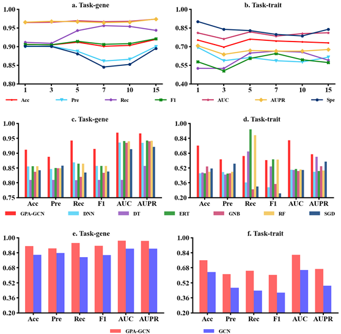

# CROP-GPA-GCN TOOL

## Synopsis

**Crop-GPA-GCN TOOL** is a computational tool for predicting new traits ( task Tt) and new genes (task Tg) based on known Gene-Phenotype Associations through GCN with graph sampling technique.


## Using the Code

### Build instructions
To examine the code in this repository, first clone the Git repository via ```git```.

```$ git clone https://qianshuai09/Crop-GPA.git```

Create a virtual environment.

```$ conda create -n crop-gpa-gcn python=3.7```

Install package

```$ conda install --yes --file requirements.txt```

Run program

```$ cd code-gpa```

```$ python main.py```


## Train Data

Data list

```$ cd data```


## Predicted Result


## Contact 
Please feel free to contact us if you need any help: zhenyuyue@ahau.edu.cn